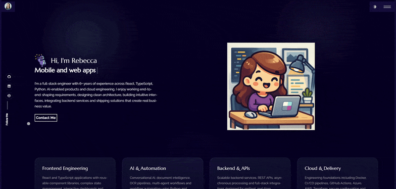

# 🚀 Rebecca Drennan's Portfolio

> A modern, responsive portfolio website showcasing projects, skills, and contact information with beautiful animations and smooth interactions.

[](https://react.dev/)
[](https://www.typescriptlang.org/)
[](https://vitejs.dev/)
[](https://getbootstrap.com/)
[](LICENSE)
[](https://github.com/yourusername/portfolio-react/actions)
[](https://prettier.io/)
[](https://eslint.org/)

## 👀 Preview

<p align="center">
	
</p>

## ✨ Features

- **🎨 Smooth Animations** - Typewriter hero effect, reveal-on-scroll transitions, and animated custom cursor
- **🎭 Theme Toggle** - Light/dark mode support for personalized viewing experience
- **📧 Contact Form** - Fully functional email integration with EmailJS for instant messaging
- **📱 Responsive Design** - Mobile-first Bootstrap layout adapting beautifully across all devices
- **♿ Accessible** - Semantic HTML, ARIA labels, keyboard navigation, and screen reader support
- **⚡ Fast Loading** - Optimized with Vite for quick development and production builds
- **🛣️ Smooth Routing** - Client-side navigation with React Router for seamless page transitions
- **🌐 SEO Ready** - Meta tags, structured data, and Open Graph support

## 🛠️ Tech Stack

| Technology            | Purpose                                  |
| --------------------- | ---------------------------------------- |
| **React 18**          | UI framework                             |
| **TypeScript**        | Type-safe JavaScript                     |
| **Vite**              | Lightning-fast build tool                |
| **React Router v6**   | Client-side routing                      |
| **Bootstrap 5**       | Responsive CSS framework                 |
| **React Bootstrap**   | Bootstrap components as React components |
| **EmailJS**           | Email sending without backend            |
| **React Icons**       | Icon library                             |
| **Typewriter Effect** | Animated text typing                     |

## 🚀 Quick Start

### Prerequisites

- Node.js 16+
- npm or yarn

### Installation

```bash
# Clone the repository
git clone https://github.com/yourusername/portfolio-react.git
cd portfolio-react

# Install dependencies
npm install

# Start development server
npm run dev
```

The site will be available at `http://localhost:5173/`

## 📝 Available Scripts

```bash
# Development server with hot reload
npm run dev

# Build for production
npm run build

# Preview production build locally
npm run preview

# Run tests
npm run test

# Deploy to GitHub Pages
npm run deploy
```

## 📁 Project Structure

```
src/
├── app/              # Main App component and routing
├── components/       # Reusable components (header, footer, etc.)
├── pages/           # Page components (home, about, contact, portfolio)
├── content/         # Content data files
├── assets/          # Images, gifs, and media
├── hooks/           # Custom React hooks
├── styles/          # Global styles
└── index.tsx        # Application entry point
```

## 🎨 Customization

### Update Content

Edit the files in `src/content/` to personalize your portfolio:

- `site.ts` - Site metadata and settings
- `about.ts` - About section content
- `portfolio.ts` - Project showcase
- `contact.ts` - Contact information

### Theme Colors

Modify the CSS variables in `src/index.css` to match your brand colors.

### Environment Variables

Create a `.env.local` file (copy from `.env.example`):

```env
VITE_EMAILJS_SERVICE_ID=your_emailjs_service_id
VITE_EMAILJS_TEMPLATE_ID=your_emailjs_template_id
VITE_EMAILJS_PUBLIC_KEY=your_emailjs_public_key
```

## 🚀 Deployment

### GitHub Pages

```bash
npm run predeploy
npm run deploy
```

### Vercel

1. Connect your repository to Vercel
2. Set environment variables in project settings
3. Deploy with a single click

### Netlify

1. Connect your repository
2. Set build command: `npm run build`
3. Set publish directory: `build`

## ♿ Accessibility

This portfolio is built with accessibility in mind:

- Semantic HTML structure
- ARIA labels and descriptions
- Keyboard navigation support
- Color contrast compliance
- Screen reader optimization

## 📚 Documentation

- [Development Guide](DEVELOPMENT.md) - Local development setup and guidelines
- [Architecture Guide](ARCHITECTURE.md) - Project structure and design decisions
- [Contributing Guide](CONTRIBUTING.md) - How to contribute to this project
- [Deployment Guide](DEPLOYMENT.md) - Deploy to various platforms
- [Configuration Reference](CONFIG.md) - All configuration options
- [Roadmap](ROADMAP.md) - Planned features and improvements
- [Changelog](CHANGELOG.md) - Version history and updates

## 📄 License

This project is licensed under the MIT License - see the [LICENSE](LICENSE) file for details.

## 🤝 Contributing

Contributions, issues, and feature requests are welcome! Feel free to check the [Contributing Guide](CONTRIBUTING.md) for more details.

## 💬 Get in Touch

Have questions or feedback? Feel free to reach out through the contact form on the website or open an issue on GitHub.

---

<div align="center">

**[Visit the Portfolio](https://drennan.dev/)** • **[GitHub](https://github.com/yourusername)** • **[LinkedIn](https://linkedin.com/in/yourprofile)**

</div>
